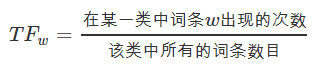
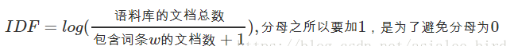
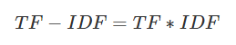
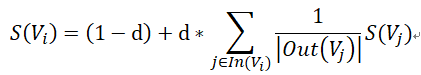
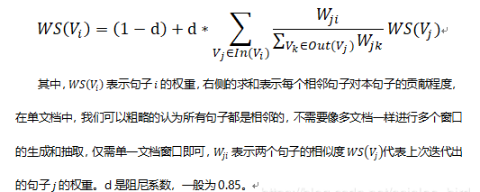

# 关键词提取

> 作者：杨夕
> 
> github : https://github.com/km1994/text_feature_extraction

## 常用的关键词提取方法介绍

- 方法类别介绍
    - TF-IDF关键词提取算法
    - TextRank关键词提取算法
    - LDA主题模型关键词提取算法
    - 互信息关键词提取算法
    - 卡方检验关键词提取算法
    - 基于树模型的关键词提取算法

### TF-IDF关键词提取算法

#### 理论基础

#### 介绍
-  类型：一种统计方法
-  作用：用以评估句子中的某一个词（字）对于整个文档的重要程度；
-  重要程度的评估：
   -  对于 句子中的某一个词（字）随着其在整个句子中的出现次数的增加，其重要性也随着增加；（正比关系）【体现词在句子中频繁性】
   -  对于 句子中的某一个词（字）随着其在整个文档中的出现频率的增加，其重要性也随着减少；（反比关系）【体现词在文档中的唯一性】
- 重要思想：
  - 如果某个单词在一篇文章中出现的频率TF高，并且在其他文章中很少出现，则认为此词或者短语具有很好的类别区分能力，适合用来分类；

#### 计算公式

- 词频 （Term Frequency，TF）
  - 介绍：体现 词 在 句子 中出现的频率；
  - 问题：
    - 当一个句子长度的增加，句子中 每一个 出现的次数 也会随之增加，导致该值容易偏向长句子；
    - 解决方法：
      - 需要做归一化（词频除以句子总字数）
  - 公式

- 逆文本频率(Inverse Document Frequency，IDF)
  - 介绍：体现 词 在文档 中出现的频率
  - 方式：某一特定词语的IDF，可以由总句子数目除以包含该词语的句子的数目，再将得到的商取对数得到；
  - 作用：如果包含词条t的文档越少, IDF越大，则说明词条具有很好的类别区分能力
  - 公式：

- TF-IDF
    - 介绍：某一特定句子内的高词语频率，以及该词语在整个文档集合中的低文档频率，可以产生出高权重的TF-IDF。因此，TF-IDF倾向于过滤掉常见的词语，保留重要的词语。
    - 优点：
      - 容易理解；
      - 容易实现；
    - 缺点：
      - 其简单结构并没有考虑词语的语义信息，无法处理一词多义与一义多词的情况

- 应用
  - 搜索引擎；
  - 关键词提取；
  - 文本相似性；
  - 文本摘要

### PageRank算法

#### 理论学习

- 论文：[The PageRank Citation Ranking: Bringing Order to the Web](http://ilpubs.stanford.edu:8090/422/1/1999-66.pdf)
- 介绍：通过计算网页链接的数量和质量来粗略估计网页的重要性，算法创立之初即应用在谷歌的搜索引擎中，对网页进行排名；
- 核心思想：
  - 链接数量：如果一个网页被越多的其他网页链接，说明这个网页越重要，即该网页的PR值（PageRank值）会相对较高；
  - 链接质量：如果一个网页被一个越高权值的网页链接，也能表明这个网页越重要，即一个PR值很高的网页链接到一个其他网页，那么被链接到的网页的PR值会相应地因此而提高；
- 计算公式

> $S(V_i)$ ： 网页 i 的 重要性；
> 
> d：托尼系数；
> 
> $ln(V_i)$：整个互联网中所存在的有指向网页 i 的链接的网页集合；
> 
> $Out(V_j)$： 网页 j 中存在的指向所有外部网页的链接的集合；
> 
> $Out(V_j)$：该集合中元素的个数；

### TextRank算法

- 论文：[TextRank: Bringing Order into Texts](https://web.eecs.umich.edu/~mihalcea/papers/mihalcea.emnlp04.pdf)
- 介绍：一种基于图的用于关键词抽取和文档摘要的排序算法，由谷歌的网页重要性排序算法PageRank算法改进而来，它利用一篇文档内部的词语间的共现信息(语义)便可以抽取关键词，它能够从一个给定的文本中抽取出该文本的关键词、关键词组，并使用抽取式的自动文摘方法抽取出该文本的关键句；
- 基本思想：将文档看作一个词的网络，该网络中的链接表示词与词之间的语义关系；
- 计算公式：

- pageRank vs TextRank
  - PageRank算法根据网页之间的链接关系构造网络，TextRank算法根据词之间的共现关系构造网络；
  - PageRank算法构造的网络中的边是有向无权边，TextRank算法构造的网络中的边是无向有权边。

